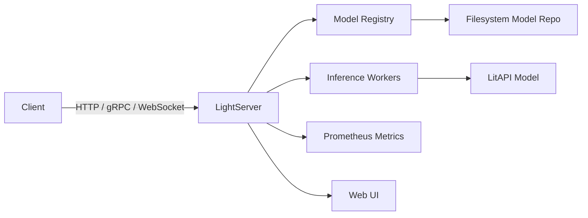

# light-server

English | [简体中文](README.md)

<p align="center">
  <strong>As simple as a Flask API, as production-ready as Triton</strong>
</p>

<p align="center">
  <a href="https://pypi.org/project/light-server/"></a>
  <a href="https://pypi.org/project/light-server/"></a>
  <a href="LICENSE"></a>
</p>

`light-server` is a Triton-style CLI deployment interface for [LitServe](https://github.com/Lightning-AI/litserve). It provides a multi-port inference server with HTTP (inference + admin), gRPC, and Prometheus metrics endpoints, backed by a filesystem-based model repository with hot-load/unload support.



## Why light-server?

| | light-server | LitServe | Triton | vLLM | BentoML |
|---|---|---|---|---|---|
| **Positioning** | Lightweight multi-framework inference server | Python inference library | Full-featured inference platform | LLM only | Full-stack MLOps |
| **Learning curve** | One command to start | Requires server code | Requires build/complex config | Needs GPU scheduling knowledge | Steep learning curve |
| **Model frameworks** | PyTorch/TF/ONNX/any Python | PyTorch/any Python | TensorRT/ONNX/PyTorch | LLM only | Multiple backends |
| **Protocols** | HTTP + gRPC + WebSocket + metrics | HTTP only | HTTP + gRPC + many protocols | HTTP + OpenAI API | HTTP + gRPC |
| **Model management** | Filesystem repo + hot load/unload | None | Model repo + versioning | Single model service | Bento repo |
| **Batching** | Adaptive batching + Continuous Batching | Adaptive batching | Dynamic batching | Continuous Batching | Requires config |
| **Resource usage** | Lightweight, single process | Lightweight | Heavy, multi-service | GPU intensive | Medium |
| **Best for** | Small-to-medium inference, rapid iteration | Quick prototyping / single model | Large-scale production clusters | LLM inference | End-to-end MLOps |

**The core value of light-server**: If you need a server that can serve multiple models (not just LLMs), supports hot updates, has monitoring metrics, and is quick to get started, light-server is lighter than Triton and more general-purpose than vLLM. It adds model repository management, multi-protocol serving, and operational capabilities on top of [LitServe](https://github.com/Lightning-AI/litserve).

## Features

- **Multi-protocol serving**: HTTP REST, gRPC, and Prometheus metrics on separate ports; WebSocket for bidirectional streaming
- **Triton-style model repository**: filesystem-based layout with versioned models
- **Hot load/unload**: load and unload models via admin APIs without restarting the server
- **Batching & streaming**: adaptive batching + Continuous Batching; configure `max_batch_size`, `batch_timeout`, streaming, and Continuous Batching per model
- **Model Analyzer**: automatically find optimal batch size / timeout / concurrency configurations
- **Benchmark tool**: built-in HTTP benchmark with latency percentiles (p50/p90/p99/p99.9)
- **Artifact packaging**: pack/unpack models into signed `.lma` artifacts for deployment
- **Structured logging**: JSON/text output with size/time-based rotation
- **Web UI**: built-in web interface for model management and observability

## 30-Second Quickstart

```bash
pip install light-server
light-server init my_project && cd my_project
light-server serve --config server.yaml
# In another terminal
curl -X POST http://127.0.0.1:8000/v2/models/my_model/infer \
  -H "Content-Type: application/json" \
  -d '{"input": "hello"}'
```

## Install

```bash
pip install light-server
```

Requires Python >= 3.10.

## Quick Start

### Option 1: Project Scaffolding (Recommended)

```bash
light-server init my_project
```

Follow the wizard to choose a template. Project code, Dockerfile, and CI config are generated automatically.

### Option 2: Manual

#### 1. Create a model repository

```bash
mkdir -p model_repo/test_model/1
```

Place your LitAPI subclass in `model_repo/test_model/1/model.py`:

```python
from light_server import LitAPI

class MyAPI(LitAPI):
    def setup(self, device):
        self.model = lambda x: x * 2

    def decode_request(self, request):
        return request["input"]

    def predict(self, x):
        return self.model(x)

    def encode_response(self, output):
        return {"result": output}
```

Optionally add `model_repo/test_model/1/config.yaml`:

```yaml
max_batch_size: 4
batch_timeout: 0.01
stream: false
```

Continuous Batching configuration (for LLM token-by-token generation):

```yaml
max_batch_size: 8          # max concurrent sequences
stream: true               # Continuous Batching requires streaming
continuous_batching: true
max_sequence_length: 2048
```

#### 2. Start the server

```bash
light-server serve --config server.yaml
```

Example `server.yaml`:

```yaml
server:
  host: 127.0.0.1
  http_port: 8000
  grpc_port: 8001
  metrics_port: 8002
  log_level: info

grpc:
  enabled: true

metrics:
  enabled: true

model_repository:
  path: ./model_repo
  control_mode: explicit

load_models:
  - test_model
```

Or start inline without a config file:

```bash
light-server serve my_module:MyAPI --port 8000
```

#### 3. Send an inference request

```bash
curl -X POST http://127.0.0.1:8000/v2/models/test_model/infer \
  -H "Content-Type: application/json" \
  -d '{"input": 5.0}'
```

#### 4. Admin APIs

```bash
# List loaded models
curl http://127.0.0.1:8000/v2/models

# Load a model
curl -X POST http://127.0.0.1:8000/v2/repository/models/my_model/load

# Unload a model
curl -X POST http://127.0.0.1:8000/v2/repository/models/my_model/unload
```

## CLI Commands

| Command | Description |
|---------|-------------|
| `serve` | Start the inference server |
| `config-check` | Validate a YAML configuration file |
| `benchmark` | Run performance benchmark against a running server |
| `analyze` | Run Model Analyzer to find optimal configuration |
| `pack` | Pack a model directory into a `.lma` artifact |
| `unpack` | Unpack a `.lma` artifact |

```bash
# Validate configuration
light-server config-check server.yaml

# Benchmark a model
light-server benchmark --model test_model --duration 30

# Analyze model for optimal config
light-server analyze --model test_model --output-dir ./reports

# Pack a model for deployment
light-server pack model_repo/test_model --version 1.0.0

# Unpack a deployed artifact
light-server unpack artifact.lma --to ./model_repo
```

## Model Repository Layout

Follows the Triton convention:

```
model_repo/
  {model_name}/
    {version}/
      model.py       # Must contain a LitAPI subclass
      config.yaml    # Optional: max_batch_size, batch_timeout, etc.
```

## Configuration

See `server.yaml` for a full example. Key sections:

- `server`: HTTP/gRPC/metrics ports, host, accelerator, timeout, logging
- `grpc`: enable/disable gRPC endpoint
- `metrics`: enable/disable Prometheus metrics
- `model_repository`: repository path and control mode (`explicit`, `poll`, `none`)
- `load_models`: list of models to auto-load on startup
- `models`: per-model overrides (batch size, streaming, accelerator, etc.)
- `webui`: built-in web interface settings

## Architecture

- **`LightServer`** (`core/server.py`): top-level orchestrator, creates registry, transport, and servers
- **`ModelManager`** (`core/model_manager.py`): handles dynamic model loading/unloading via `mp.spawn`
- **`ModelRegistry`** (`core/registry.py`): cross-process shared state via `mp.Manager().dict()`
- **HTTP handlers** (`http/handlers.py`): async inference with response consumer pattern
- **Admin APIs** (`http/admin.py`): model lifecycle and readiness checks

## Examples

See the [`examples/`](examples/) directory for runnable examples:

| Example | Description |
|---------|-------------|
| [`01_quickstart`](examples/01_quickstart/) | Minimal model — serve, infer, admin APIs |
| [`02_advanced`](examples/02_advanced/) | Batching + custom metrics + hot reload + versioning |
| [`03_cv_pipeline`](examples/03_cv_pipeline/) | Real CV pipeline — image preprocessing + ResNet classification |
| [`04_llm_streaming`](examples/04_llm_streaming/) | LLM streaming inference — WebSocket token-by-token generation |
| [`05_docker`](examples/05_docker/) | Docker containerized deployment — Dockerfile + docker-compose |
| [`06_text_classification`](examples/06_text_classification/) | Real NLP classification — DistilBERT sentiment analysis + adaptive batching |

Each example includes a `run.sh` one-shot script and `test_model.py` for standalone model validation.

## License

MIT
