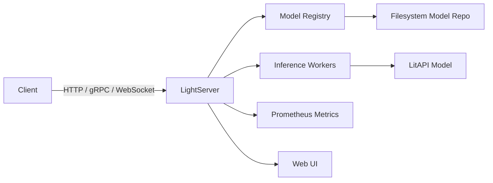

# light-server

[English](README.en.md) | 简体中文

<p align="center">
  <strong>像写 Flask 接口一样简单，像 Triton 一样生产可用</strong>
</p>

<p align="center">
  <a href="https://pypi.org/project/light-server/"></a>
  <a href="https://pypi.org/project/light-server/"></a>
  <a href="LICENSE"></a>
</p>

`light-server` 是基于 [LitServe](https://github.com/Lightning-AI/litserve) 的 Triton 风格 CLI 部署接口。它提供多端口推理服务（HTTP 推理 + 管理、gRPC、Prometheus 指标），以基于文件系统的模型仓库为后端，支持模型的热加载与热卸载。



## 为什么选择 light-server？

| | light-server | LitServe | Triton | vLLM | BentoML |
|---|---|---|---|---|---|
| **定位** | 轻量多框架推理服务 | Python 推理库 | 全功能推理平台 | 仅 LLM | 全栈 MLOps |
| **上手难度** | 一条命令启动 | 需自行编写 server 代码 | 需要编译/复杂配置 | 需了解 GPU 调度 | 学习曲线陡峭 |
| **模型框架** | PyTorch/TF/ONNX/任意 Python | PyTorch/任意 Python | TensorRT/ONNX/PyTorch | 仅 LLM | 多种后端 |
| **协议支持** | HTTP + gRPC + WebSocket + 指标 | 仅 HTTP | HTTP + gRPC + 多种协议 | HTTP + OpenAI API | HTTP + gRPC |
| **模型管理** | 文件系统仓库 + 热加载/卸载 | 无 | 模型仓库 + 版本管理 | 单模型服务 | Bento 仓库 |
| **批处理** | 自适应批处理 + Continuous Batching | 自适应批处理 | 动态批处理 | Continuous Batching | 需配置 |
| **资源占用** | 轻量，单进程起步 | 轻量 | 较重，多服务组件 | GPU 密集型 | 中等 |
| **最佳场景** | 中小规模推理服务、快速迭代 | 快速原型/单模型 | 大规模生产推理集群 | 大模型推理 | 端到端 MLOps |

**light-server 的核心价值**：如果你需要一个能同时服务多个模型（不限于 LLM）、支持热更新、有监控指标、又能快速上手的推理服务器，light-server 是比 Triton 更轻、比 vLLM 更通用的选择。它在 [LitServe](https://github.com/Lightning-AI/litserve) 之上增加了模型仓库管理、多协议服务和运维能力。

## 特性

- **多协议服务**：HTTP REST、gRPC 和 Prometheus 指标分别监听不同端口，WebSocket 支持双向流式推理
- **Triton 风格模型仓库**：基于文件系统的分层结构，支持版本化管理
- **热加载/卸载**：通过管理 API 加载和卸载模型，无需重启服务
- **批处理与流式**：自适应批处理 + Continuous Batching；每个模型可独立配置 `max_batch_size`、`batch_timeout`、流式响应和 Continuous Batching
- **模型分析器**：自动寻找最优的批大小 / 超时时间 / 并发配置
- **基准测试工具**：内置 HTTP 压测，输出 p50/p90/p99/p99.9 延迟分位值
- **制品打包**：将模型目录打包为带签名的 `.lma` 制品，便于部署
- **结构化日志**：支持 JSON/文本格式，按大小或时间轮转
- **Web UI**：内置 Web 界面，用于模型管理与可观测性

## 30 秒跑通

```bash
pip install light-server
light-server init my_project && cd my_project
light-server serve --config server.yaml
# 另开终端
curl -X POST http://127.0.0.1:8000/v2/models/my_model/infer \
  -H "Content-Type: application/json" \
  -d '{"input": "hello"}'
```

## 安装

```bash
pip install light-server
```

需要 Python >= 3.10。

### 从源码开发

本项目使用 [uv](https://docs.astral.sh/uv/) 管理依赖：

```bash
# 克隆仓库并同步依赖
uv sync

# 运行测试
uv run pytest tests/ -v

# 启动服务（开发模式）
uv run light-server serve --config server.yaml
```

## 快速开始

### 方式一：项目脚手架（推荐）

```bash
light-server init my_project
```

跟随向导选择模板，自动生成模型代码、Dockerfile、CI 配置。

### 方式二：手动创建

#### 1. 创建模型仓库

```bash
mkdir -p model_repo/test_model/1
```

在 `model_repo/test_model/1/model.py` 中放置你的 LitAPI 子类：

```python
from light_server import LitAPI

class MyAPI(LitAPI):
    def setup(self, device):
        self.model = lambda x: x * 2

    def decode_request(self, request):
        return request["input"]

    def predict(self, x):
        return self.model(x)

    def encode_response(self, output):
        return {"result": output}
```

可选地在 `model_repo/test_model/1/config.yaml` 中添加配置：

```yaml
max_batch_size: 4
batch_timeout: 0.01
stream: false
```

Continuous Batching 配置（适用于 LLM 逐 token 生成场景）：

```yaml
max_batch_size: 8          # 同时活跃的序列数上限
stream: true               # Continuous Batching 必须启用流式
continuous_batching: true
max_sequence_length: 2048
```

#### 2. 启动服务

```bash
light-server serve --config server.yaml
```

示例 `server.yaml`：

```yaml
server:
  host: 127.0.0.1
  http_port: 8000
  grpc_port: 8001
  metrics_port: 8002
  log_level: info

grpc:
  enabled: true

metrics:
  enabled: true

model_repository:
  path: ./model_repo
  control_mode: explicit

load_models:
  - test_model
```

也可以不通过配置文件直接启动：

```bash
light-server serve my_module:MyAPI --port 8000
```

#### 3. 发送推理请求

```bash
curl -X POST http://127.0.0.1:8000/v2/models/test_model/infer \
  -H "Content-Type: application/json" \
  -d '{"input": 5.0}'
```

#### 4. 管理 API

```bash
# 查看已加载模型
curl http://127.0.0.1:8000/v2/models

# 加载模型
curl -X POST http://127.0.0.1:8000/v2/repository/models/my_model/load

# 卸载模型
curl -X POST http://127.0.0.1:8000/v2/repository/models/my_model/unload
```

## CLI 命令

| 命令 | 说明 |
|------|------|
| `serve` | 启动推理服务 |
| `config-check` | 校验 YAML 配置文件 |
| `benchmark` | 对运行中的服务执行性能压测 |
| `analyze` | 运行模型分析器，寻找最优配置 |
| `pack` | 将模型目录打包为 `.lma` 制品 |
| `unpack` | 解包 `.lma` 制品 |

```bash
# 校验配置
light-server config-check server.yaml

# 压测模型
light-server benchmark --model test_model --duration 30

# 分析模型最优配置
light-server analyze --model test_model --output-dir ./reports

# 打包模型用于部署
light-server pack model_repo/test_model --version 1.0.0

# 解包部署制品
light-server unpack artifact.lma --to ./model_repo
```

## 模型仓库结构

遵循 Triton 规范：

```
model_repo/
  {model_name}/
    {version}/
      model.py       # 必须包含 LitAPI 子类
      config.yaml    # 可选：max_batch_size、batch_timeout 等
```

## 配置说明

完整示例见 `server.yaml`。主要配置段：

- `server`：HTTP/gRPC/指标端口、监听地址、加速器、超时、日志级别、API 服务器数量
- `grpc`：启用/禁用 gRPC 端点、`max_workers`
- `metrics`：启用/禁用 Prometheus 指标
- `model_repository`：仓库路径和控制模式（`explicit` 显式加载、`poll` 轮询自动检测、`none` 加载全部）
- `load_models`：启动时自动加载的模型列表
- `models`：单模型覆盖配置（批大小、流式、加速器等）
- `logging`：日志模式、格式、输出路径、轮转策略
- `webui`：内置 Web 界面设置

完整配置字段说明见 [配置详解](docs/zh/02_配置详解.md)。

## 文档

详细文档见 [`docs/zh/`](docs/zh/) 目录：

| 文档 | 内容 |
|------|------|
| [快速开始](docs/zh/01_快速开始.md) | 安装 + 3 分钟上手 |
| [配置详解](docs/zh/02_配置详解.md) | 完整配置字段说明 + 优先级规则 |
| [模型开发指南](docs/zh/03_模型开发指南.md) | LitAPI 生命周期 + 批处理/流式/指标/版本控制 |
| [API 参考](docs/zh/04_API参考.md) | HTTP/gRPC 端点 + 状态码 |
| [CLI 命令参考](docs/zh/05_CLI命令参考.md) | 6 个子命令完整参数 |
| [运维指南](docs/zh/06_运维指南.md) | Prometheus + 日志 + 制品打包 + 分析器 + WebUI |
| [架构设计](docs/zh/07_架构设计.md) | 进程模型 + 请求链路 + Mermaid 图 |
| [FAQ](docs/zh/08_常见问题.md) | 常见问题与性能调优 |

英文文档见 [`docs/en/`](docs/en/)。

## 示例

见 [`examples/`](examples/) 目录，包含可直接运行的示例：

| 示例 | 说明 |
|------|------|
| [`01_quickstart`](examples/01_quickstart/) | 智能文本增强 — 启动、推理、管理 API |
| [`02_advanced`](examples/02_advanced/) | 进阶特性 — 批处理 + 自定义指标 + 热重载 + 版本管理 |
| [`03_cv_pipeline`](examples/03_cv_pipeline/) | 真实 CV 流水线 — 图像预处理 + ResNet 分类 |
| [`04_llm_streaming`](examples/04_llm_streaming/) | LLM 流式推理 — WebSocket 逐 token 生成 |
| [`05_docker`](examples/05_docker/) | Docker 容器化部署 — Dockerfile + docker-compose |
| [`06_text_classification`](examples/06_text_classification/) | 真实 NLP 分类 — DistilBERT 情感分析 + 自适应批处理 |
| [`07_batching_speedup`](examples/07_batching_speedup/) | Batching 加速对比 — 用数据展示吞吐飞跃 |
| [`08_grpc_client`](examples/08_grpc_client/) | gRPC 高性能调用 — 对比 HTTP REST 延迟 |
| [`09_openai_compatible`](examples/09_openai_compatible/) | OpenAI 格式适配 — 响应实时转换 |
| [`10_ensemble_pipeline`](examples/10_ensemble_pipeline/) | DAG 多模型流水线编排、层内并行、层间串行 |
| [`11_hooks_and_endpoints`](examples/11_hooks_and_endpoints/) | 模型生命周期 Hooks + 动态端点 — 请求/响应拦截 + 自定义路由 |

每个示例都包含 `run.sh` 一键运行脚本和 `test_model.py` 模型逻辑验证。

## 许可证

MIT
