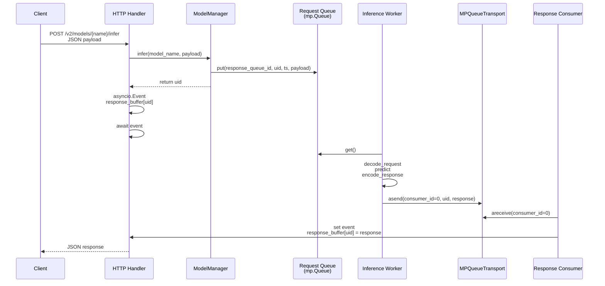
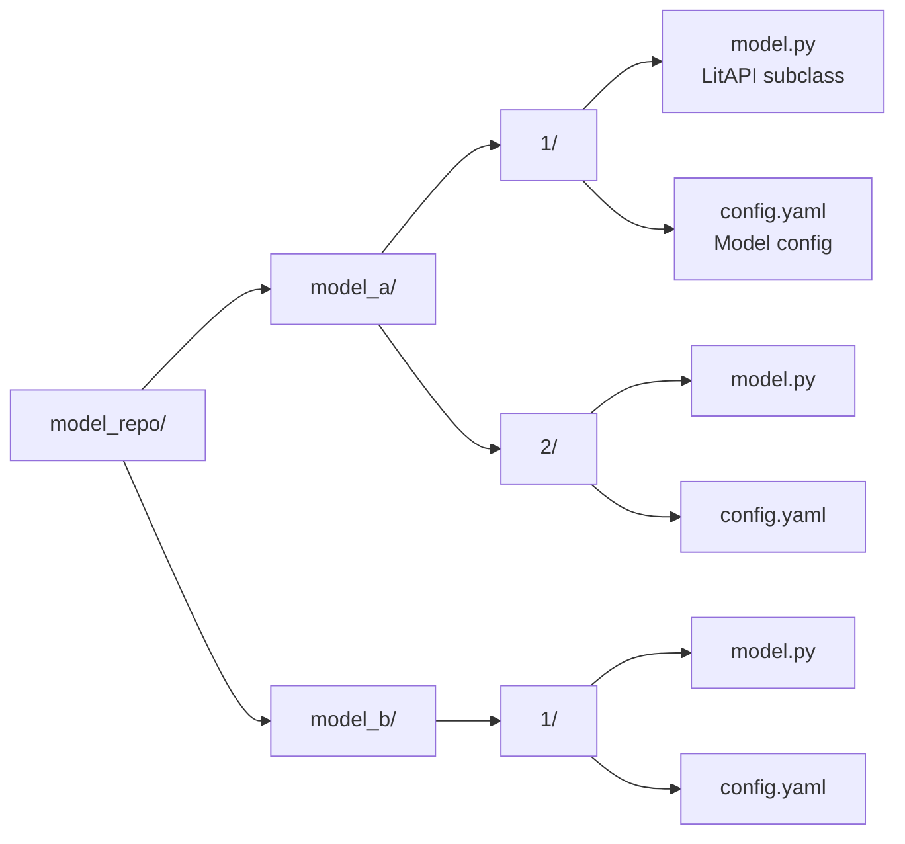

[简体中文](../zh/07_architecture.md) | English

# Architecture

## Process Model

```mermaid
graph TB
    subgraph "Main Process"
        M[mp.Manager<br/>Shared Dict + Queue]
        LS[LightServer<br/>Orchestrator]
        MM[ModelManager<br/>Load/Unload/Infer]
        MR[ModelRegistry<br/>mp.Manager.dict()]
        Transport[MPQueueTransport<br/>Worker → HTTP Response]
    end

    subgraph "HTTP Process (Uvicorn workers=1)"
        FA[FastAPI App]
        HC[HTTP Handlers<br/>/v2/models/{name}/infer]
        AC[Admin APIs<br/>/v2/models, /v2/repository/*]
        RC[Response Consumer<br/>async loop]
    end

    subgraph "Worker Processes (mp.spawn)"
        W1[Worker 1<br/>_inference_worker_wrapper]
        W2[Worker 2<br/>_inference_worker_wrapper]
        WN[Worker N ...]
    end

    subgraph "External Endpoints"
        PROM[Prometheus<br/>:metrics_port/metrics]
        GRPC[gRPC Server<br/>:grpc_port]
    end

    LS --> M
    LS --> MM
    LS --> FA
    MM --> MR
    MM --> W1
    MM --> W2
    FA --> HC
    FA --> AC
    HC --> MM
    RC --> Transport
    W1 --> Transport
    W2 --> Transport
    FA --> PROM
    FA --> GRPC
```

### Process Description

| Process | Count | Responsibility |
|---------|-------|----------------|
| Main Process | 1 | Create shared state, start HTTP/gRPC servers, manage model lifecycle |
| HTTP Process | 1 | Handle HTTP requests (`uvicorn workers=1` ensures access to shared state) |
| Worker Processes | N | Execute actual inference (each model has its own worker group) |

---

## Inference Request Flow



### Flow Description

1. **HTTP Handler** receives request, generates unique `uid`
2. **ModelManager** puts `(response_queue_id, uid, timestamp, payload)` into the model's request queue
3. Handler creates `asyncio.Event` and waits
4. **Inference Worker** pulls request from queue, executes `decode_request` → `predict` → `encode_response`
5. Worker sends response via `MPQueueTransport`
6. **Response Consumer** (background async task) continuously receives responses, wakes the corresponding Handler
7. Handler returns JSON to client

---

## Model Repository Layout



---

## Spawn Safety Design

`light-server` uses `mp.get_context("spawn")` to start worker processes (cross-platform compatible).

**Key Problem**: In spawn mode, child processes do not inherit the parent process's Python module import state.

**Solution**:

```python
# ModelManager.load()
# Parent process only passes the model.py path string
def load(self, model_name, version="1"):
    model_py_path = Path(repo) / model_name / version / "model.py"
    # Pass path string when starting worker
    worker_args = (str(model_py_path), ...)
    mp.Process(target=_inference_worker_wrapper, args=worker_args).start()

# Worker re-imports internally
def _inference_worker_wrapper(model_py_path, ...):
    from light_server.core.loader import load_litapi_from_file
    LitAPIClass = load_litapi_from_file(Path(model_py_path))
    api = LitAPIClass()
    api.setup(device)
    # Start consuming request queue
```

This ensures:
- Works on macOS/Unix/Windows
- After modifying model files, reloaded workers use the latest code
- Parent process doesn't need to keep model directory in sys.path

---

## Shared State

| Component | Type | Purpose |
|-----------|------|---------|
| `ModelRegistry` | `mp.Manager().dict()` | Cross-process model loading state |
| `Request Queue` | `mp.Manager().Queue()` | Per-model, HTTP → Worker |
| `Response Buffer` | `dict[uid, asyncio.Event]` | Within HTTP process, wait for worker response |
| `MPQueueTransport` | LitServe component | Worker → HTTP response transport |

---

## Next Steps

- [FAQ](08_faq.md)
- [Model Development Guide](03_model_development.md)
