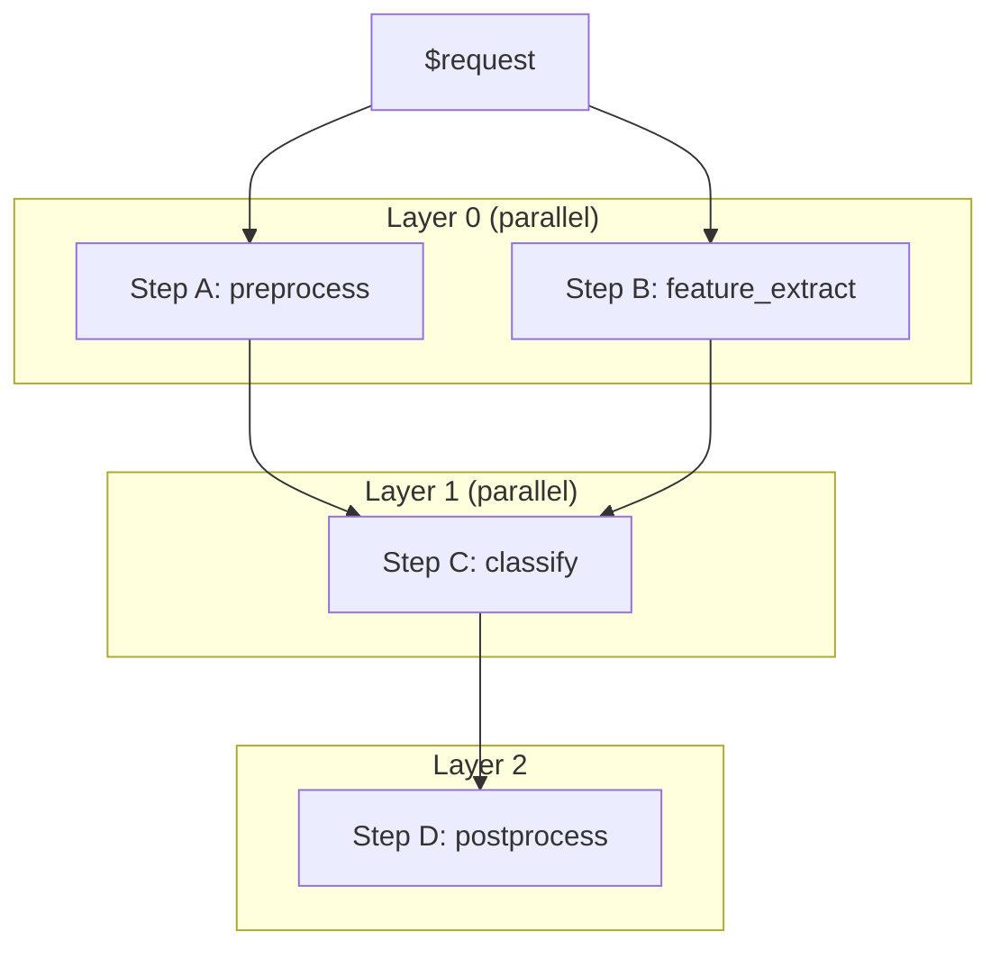

[简体中文](../zh/09_模型管理.md) | English

# Model Management

This document covers model-level strategy configuration (`model_config.yaml`), version management, and ensemble pipeline orchestration.

---

## 1. Configuration Hierarchy

`light-server` has three configuration layers. When the same field is defined in multiple places, priority from high to low:

```
Version-level config.yaml  (highest)
        ↓
Model-level model_config.yaml
        ↓
Global server.yaml "models" field
        ↓
Global server.yaml "server" field  (defaults)
```

| Layer | File Location | Scope |
|-------|--------------|-------|
| **Version-level** | `model_repo/{name}/{version}/config.yaml` | A single version only |
| **Model-level** | `model_repo/{name}/model_config.yaml` | All versions of this model; controls loading policy and version strategy |
| **Global** | `server.yaml` | All models |

---

## 2. model_config.yaml

Placed at `model_repo/{model_name}/model_config.yaml`, this file controls **model-level loading policy and version strategy**.

### Full Template

```yaml
default_version: "1"
load_policy: explicit
versions_to_load:
  - "1"
  - "2"
max_loaded_versions: 2
```

### Field Reference

| Field | Type | Default | Description |
|-------|------|---------|-------------|
| `default_version` | str | — | The version to activate by default after loading |
| `load_policy` | str | `explicit` | Which versions to load at startup: `explicit` / `all` / `latest` |
| `versions_to_load` | list[str] | — | Required when `load_policy: explicit`; list of version strings to load |
| `max_loaded_versions` | int | — | Maximum number of READY versions to keep loaded; oldest is unloaded first |

### Load Policy Comparison

| Policy | Behavior | Use Case |
|--------|----------|----------|
| `explicit` | Only load versions listed in `versions_to_load` | Production, precise control |
| `all` | Load every version found in the model directory | Development, testing all variants |
| `latest` | Load only the highest version number | Staging, always use newest |

### Configuration Example

**Model directory:**

```
model_repo/
  my_model/
    model_config.yaml
    1/
      model.py
      config.yaml
    2/
      model.py
      config.yaml
    3/
      model.py
      config.yaml
```

**`model_config.yaml`:**

```yaml
default_version: "2"
load_policy: explicit
versions_to_load:
  - "1"
  - "2"
max_loaded_versions: 2
```

**Behavior:**
- At startup, versions `1` and `2` are loaded; version `3` is ignored
- After loading, version `2` is automatically activated (becomes the default for inference)
- If version `3` is later loaded via the Admin API, `max_loaded_versions: 2` triggers unloading of version `1` (the oldest)

### Validation Example

**Scenario:** `load_policy: explicit` but `versions_to_load` is missing or empty.

```yaml
load_policy: explicit
# versions_to_load omitted
```

**Result:** No versions are loaded at startup. The model remains unavailable until manually loaded via the Admin API:

```bash
curl -X POST http://127.0.0.1:8000/v2/repository/models/my_model/load \
  -H "Content-Type: application/json" \
  -d '{"version": "1"}'
```

**Scenario:** `load_policy: latest` with multiple versions.

```yaml
load_policy: latest
```

**Result:** Only the highest version number is loaded. If versions `1`, `2`, `3` exist, only `3` is loaded and activated.

---

## 3. Version Management

### Version Directory Structure

Follows the Triton convention:

```
model_repo/
  {model_name}/
    model_config.yaml
    {version}/
      model.py
      config.yaml
```

### Version Lifecycle

```
LOADING → READY → UNLOADING → (removed)
   │        │
   └───────→ ERROR
```

| Status | Meaning |
|--------|---------|
| `LOADING` | Workers are starting, model not yet ready |
| `READY` | Model is loaded and can serve requests |
| `UNLOADING` | Workers are being terminated |
| `ERROR` | Loading failed or runtime error occurred |

### Active Version and Inference Routing

Each model has an **active version**. Inference requests that do not specify a version are routed to the active version.

```bash
# No version specified → routes to active version
curl -X POST http://127.0.0.1:8000/v2/models/my_model/infer \
  -d '{"input": 5}'

# Specific version → bypasses active version routing
curl -X POST http://127.0.0.1:8000/v2/models/my_model/versions/2/infer \
  -d '{"input": 5}'
```

**Activation rules:**

1. If `model_config.yaml` specifies `default_version`, that version is activated after loading
2. Otherwise, the first version that reaches READY state is activated automatically
3. A version must be in `READY` state to be activated

### Admin API Operations

```bash
# List all loaded versions and their status
curl http://127.0.0.1:8000/v2/models/my_model

# Activate a specific version
curl -X POST http://127.0.0.1:8000/v2/repository/models/my_model/load \
  -H "Content-Type: application/json" \
  -d '{"version": "2"}'

# Unload a specific version
curl -X POST http://127.0.0.1:8000/v2/repository/models/my_model/unload \
  -H "Content-Type: application/json" \
  -d '{"version": "1"}'
```

### max_loaded_versions Enforcement

When `max_loaded_versions` is set, loading a new version beyond the limit automatically unloads the oldest READY version.

```
Loaded: [v1(READY), v2(READY)]  max_loaded_versions=2
  → Load v3
  → Unload v1 (oldest)
  → Loaded: [v2(READY), v3(READY)]
```

---

## 4. Ensemble Pipeline

An **ensemble** is a DAG-based multi-model pipeline defined entirely in `config.yaml`. No `model.py` is required.

### Configuration Syntax

```yaml
# model_repo/{ensemble_name}/{version}/config.yaml
ensemble:
  steps:
    - name: step_name        # Unique identifier within this ensemble
      model: sub_model       # Name of a model in the repository
      version: "1"           # Version to invoke
      inputs:
        input_field: "$request.field_name"      # Read from request payload
        other_input: "$previous_step.field"     # Read from another step's output
```

### Reference Syntax

| Pattern | Meaning | Example |
|---------|---------|---------|
| `$request.field` | Read a field from the original request payload | `$request.image_base64` |
| `$step_name.field` | Read a field from a previous step's output | `$preprocess.tensor` |
| `$step_name` | Use the entire output dict of a previous step | `$preprocess` |

### Execution Model

Ensembles execute as a **topologically sorted DAG**:



**Key properties:**
- **Parallel within layer:** Steps with no inter-dependencies execute concurrently via `asyncio.gather`
- **Sequential across layers:** A layer must complete before the next layer starts
- **Auto-loading:** If a sub-model is not loaded, the ensemble attempts to load it automatically
- **No workers:** Ensemble models do not spawn inference workers; they orchestrate other models

### Validation

The ensemble parser validates at load time:

1. **Unique step names** — duplicate names raise `EnsembleParserError`
2. **Valid references** — all `$ref` patterns must match `^$\w+(?:\.\w+)?$`
3. **Resolvable references** — referenced steps must exist in the ensemble
4. **No cycles** — Kahn's algorithm detects and rejects cyclic dependencies

### Complete Example: Image Preprocessing + Classification

**`model_repo/image_pipeline/1/config.yaml`:**

```yaml
name: image_pipeline
ensemble:
  steps:
    - name: preprocess
      model: image_preprocess
      version: "1"
      inputs:
        image_base64: "$request.image"

    - name: classify
      model: resnet_classifier
      version: "1"
      inputs:
        tensor: "$preprocess.tensor"
        shape: "$preprocess.shape"

    - name: format
      model: result_formatter
      version: "1"
      inputs:
        raw_output: "$classify"
```

**Request:**

```bash
curl -X POST http://127.0.0.1:8000/v2/models/image_pipeline/infer \
  -H "Content-Type: application/json" \
  -d '{"image": "iVBORw0KGgoAAAANSUhEUgAAAAEAAAABCAYAAAAfFcSJAAAADUlEQVR42mNk+M9QDwADhgGAWjR9awAAAABJRU5ErkJgg5"}'
```

**Execution flow:**

1. `preprocess` receives `{"image_base64": "..."}` → outputs `{"tensor": [...], "shape": [3,224,224]}`
2. `classify` receives `{"tensor": [...], "shape": [3,224,224]}` → outputs `{"top5": [...]}`
3. `format` receives the entire `classify` output → returns formatted result

### Common Patterns

**Sequential chain:**

```yaml
ensemble:
  steps:
    - name: step1
      model: model_a
      version: "1"
      inputs:
        x: "$request.x"
    - name: step2
      model: model_b
      version: "1"
      inputs:
        x: "$step1.y"
```

**Parallel branches:**

```yaml
ensemble:
  steps:
    - name: branch_a
      model: model_a
      version: "1"
      inputs:
        x: "$request.x"
    - name: branch_b
      model: model_b
      version: "1"
      inputs:
        x: "$request.x"
    - name: merge
      model: model_c
      version: "1"
      inputs:
        a: "$branch_a.y"
        b: "$branch_b.y"
```

---

## 5. Putting It All Together

**Full model repository with version management + ensemble:**

```
model_repo/
  image_preprocess/
    model_config.yaml
    1/
      model.py
      config.yaml
  resnet_classifier/
    model_config.yaml
    1/
      model.py
      config.yaml
    2/
      model.py
      config.yaml
  image_pipeline/
    1/
      config.yaml     # ensemble definition, no model.py needed
```

**`image_preprocess/model_config.yaml`:**

```yaml
default_version: "1"
load_policy: all
```

**`resnet_classifier/model_config.yaml`:**

```yaml
default_version: "1"
load_policy: explicit
versions_to_load:
  - "1"
  - "2"
max_loaded_versions: 2
```

**`server.yaml`:**

```yaml
server:
  http_port: 8000

model_repository:
  path: "./model_repo"
  control_mode: explicit

load_models:
  - image_preprocess
  - resnet_classifier
  - image_pipeline
```

At startup:
1. `image_preprocess` loads version `1` (only version available, `load_policy: all`)
2. `resnet_classifier` loads versions `1` and `2`; version `1` is activated as default
3. `image_pipeline` parses its ensemble DAG and becomes READY (no workers spawned)
4. Sending a request to `image_pipeline` triggers the ensemble: preprocess → classify

---

## Next Steps

- [Configuration Guide](02_configuration.md) — server.yaml and config.yaml reference
- [Architecture](07_architecture.md) — process model and request flow
- [Examples](../../examples/10_ensemble_pipeline/) — runnable ensemble demo
