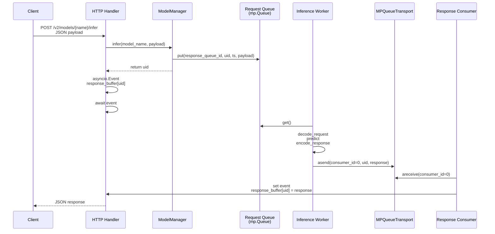
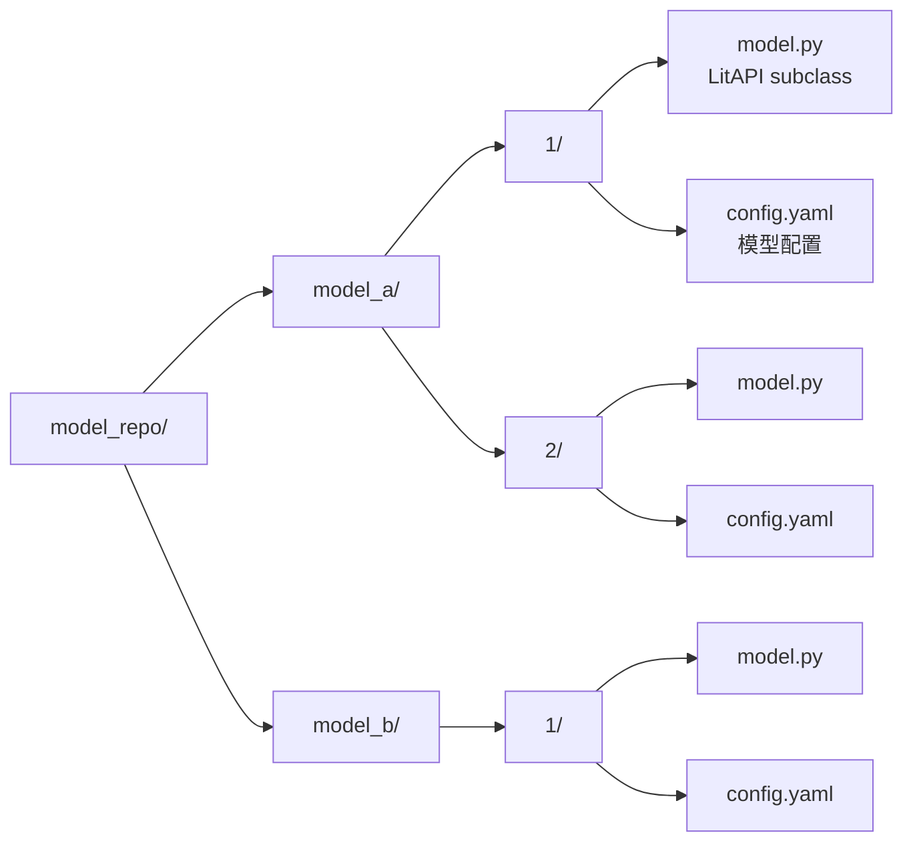

[English](../en/07_architecture.md) | 简体中文

# 架构设计

## 进程模型

```mermaid
graph TB
    subgraph "主进程 (Main Process)"
        M[mp.Manager<br/>共享字典 + Queue]
        LS[LightServer<br/>编排器]
        MM[ModelManager<br/>加载/卸载/推理]
        MR[ModelRegistry<br/>mp.Manager.dict()]
        Transport[MPQueueTransport<br/>worker → HTTP 响应]
    end

    subgraph "HTTP 进程 (Uvicorn workers=1)"
        FA[FastAPI App]
        HC[HTTP Handlers<br/>/v2/models/{name}/infer]
        AC[Admin APIs<br/>/v2/models, /v2/repository/*]
        RC[Response Consumer<br/>async loop]
    end

    subgraph "Worker 进程 (mp.spawn)"
        W1[Worker 1<br/>_inference_worker_wrapper]
        W2[Worker 2<br/>_inference_worker_wrapper]
        WN[Worker N ...]
    end

    subgraph "外部端点"
        PROM[Prometheus<br/>:metrics_port/metrics]
        GRPC[gRPC Server<br/>:grpc_port]
    end

    LS --> M
    LS --> MM
    LS --> FA
    MM --> MR
    MM --> W1
    MM --> W2
    FA --> HC
    FA --> AC
    HC --> MM
    RC --> Transport
    W1 --> Transport
    W2 --> Transport
    FA --> PROM
    FA --> GRPC
```

### 进程说明

| 进程 | 数量 | 职责 |
|------|------|------|
| 主进程 | 1 | 创建共享状态、启动 HTTP/gRPC 服务器、管理模型生命周期 |
| HTTP 进程 | 1 | 处理 HTTP 请求（`uvicorn workers=1` 确保能访问共享状态） |
| Worker 进程 | N | 执行实际推理（每个模型独立一组 worker） |

---

## 推理请求链路



### 链路说明

1. **HTTP Handler** 接收请求，生成唯一 `uid`
2. **ModelManager** 将 `(response_queue_id, uid, timestamp, payload)` 放入模型的请求队列
3. Handler 创建 `asyncio.Event` 并等待
4. **Inference Worker** 从队列取出请求，执行 `decode_request` → `predict` → `encode_response`
5. Worker 通过 `MPQueueTransport` 发送响应
6. **Response Consumer**（后台 async 任务）持续接收响应，唤醒对应的 Handler
7. Handler 返回 JSON 给客户端

---

## 模型仓库布局



---

## Spawn 安全设计

`light-server` 使用 `mp.get_context("spawn")` 启动 worker 进程（跨平台兼容）。

**关键问题**：spawn 模式下，子进程不会继承父进程的 Python 模块导入状态。

**解决方案**：

```python
# ModelManager.load()
# 父进程只传递 model.py 的路径字符串
def load(self, model_name, version="1"):
    model_py_path = Path(repo) / model_name / version / "model.py"
    # 启动 worker 时传递路径字符串
    worker_args = (str(model_py_path), ...)
    mp.Process(target=_inference_worker_wrapper, args=worker_args).start()

# Worker 内部重新导入
def _inference_worker_wrapper(model_py_path, ...):
    from light_server.core.loader import load_litapi_from_file
    LitAPIClass = load_litapi_from_file(Path(model_py_path))
    api = LitAPIClass()
    api.setup(device)
    # 开始消费请求队列
```

这种方式确保：
- macOS/Unix/Windows 都能正常工作
- 模型文件修改后，重新加载的 worker 会使用最新代码
- 父进程不需要在 sys.path 中保留模型目录

---

## 共享状态

| 组件 | 类型 | 用途 |
|------|------|------|
| `ModelRegistry` | `mp.Manager().dict()` | 跨进程模型加载状态 |
| `Request Queue` | `mp.Manager().Queue()` | 每个模型独立，HTTP → Worker |
| `Response Buffer` | `dict[uid, asyncio.Event]` | HTTP 进程内，等待 worker 响应 |
| `MPQueueTransport` | LitServe 组件 | Worker → HTTP 响应传输 |

---

## 下一步

- [FAQ](08_faq.md)
- [模型开发指南](03_model_development.md)
