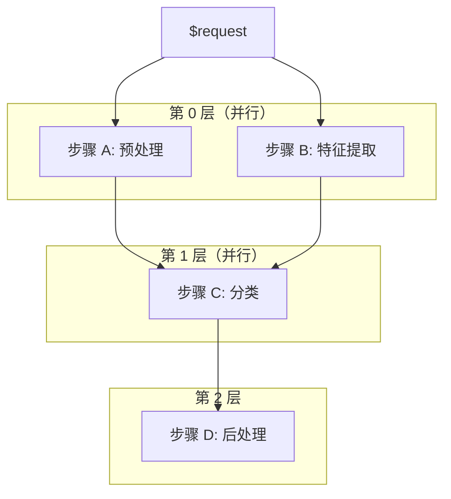

[English](../en/09_model_management.md) | 简体中文

# 模型管理

本文档涵盖模型级策略配置（`model_config.yaml`）、版本管理和 Ensemble 流水线编排。

---

## 1. 配置层级总览

`light-server` 具有三层配置。当同一字段在多处定义时，优先级从高到低：

```
版本级 config.yaml  （最高优先级）
        ↓
模型级 model_config.yaml
        ↓
全局 server.yaml 的 models 字段
        ↓
全局 server.yaml 的 server 字段 （默认值）
```

| 层级 | 文件位置 | 作用范围 |
|------|---------|---------|
| **版本级** | `model_repo/{name}/{version}/config.yaml` | 仅当前版本 |
| **模型级** | `model_repo/{name}/model_config.yaml` | 该模型的所有版本；控制加载策略和版本策略 |
| **全局** | `server.yaml` | 所有模型 |

---

## 2. model_config.yaml

放在 `model_repo/{model_name}/model_config.yaml`，此文件控制**模型级的加载策略和版本策略**。

### 完整模板

```yaml
default_version: "1"
load_policy: explicit
versions_to_load:
  - "1"
  - "2"
max_loaded_versions: 2
```

### 字段说明

| 字段 | 类型 | 默认值 | 说明 |
|------|------|--------|------|
| `default_version` | str | — | 加载完成后默认激活的版本 |
| `load_policy` | str | `explicit` | 启动时加载哪些版本：`explicit` / `all` / `latest` |
| `versions_to_load` | list[str] | — | `load_policy: explicit` 时必填；要加载的版本号列表 |
| `max_loaded_versions` | int | — | 最多保持多少个 READY 版本已加载；超出时先卸载最旧的 |

### 加载策略对比

| 策略 | 行为 | 适用场景 |
|------|------|----------|
| `explicit` | 仅加载 `versions_to_load` 列出的版本 | 生产环境，精确控制 |
| `all` | 加载该模型目录下的所有版本 | 开发环境，测试所有变体 |
| `latest` | 仅加载版本号最高的版本 | 预发布环境，始终使用最新版 |

### 配置示例

**模型目录：**

```
model_repo/
  my_model/
    model_config.yaml
    1/
      model.py
      config.yaml
    2/
      model.py
      config.yaml
    3/
      model.py
      config.yaml
```

**`model_config.yaml`：**

```yaml
default_version: "2"
load_policy: explicit
versions_to_load:
  - "1"
  - "2"
max_loaded_versions: 2
```

**行为说明：**
- 启动时加载版本 `1` 和 `2`；版本 `3` 被忽略
- 加载完成后，版本 `2` 自动被激活（成为推理的默认版本）
- 如果之后通过 Admin API 加载版本 `3`，`max_loaded_versions: 2` 会触发卸载版本 `1`（最旧的）

### 配置验证示例

**场景一：** `load_policy: explicit` 但缺少 `versions_to_load`

```yaml
load_policy: explicit
# 省略了 versions_to_load
```

**结果：** 启动时不加载任何版本。模型保持不可用状态，直到通过 Admin API 手动加载：

```bash
curl -X POST http://127.0.0.1:8000/v2/repository/models/my_model/load \
  -H "Content-Type: application/json" \
  -d '{"version": "1"}'
```

**场景二：** `load_policy: latest` 配合多个版本

```yaml
load_policy: latest
```

**结果：** 仅加载版本号最高的版本。如果存在版本 `1`、`2`、`3`，则只加载 `3` 并激活。

---

## 3. 模型版本管理

### 版本目录结构

遵循 Triton 约定：

```
model_repo/
  {model_name}/
    model_config.yaml
    {version}/
      model.py
      config.yaml
```

### 版本生命周期

```
LOADING → READY → UNLOADING → （移除）
   │        │
   └───────→ ERROR
```

| 状态 | 含义 |
|------|------|
| `LOADING` | Worker 正在启动，模型尚未就绪 |
| `READY` | 模型已加载，可以处理请求 |
| `UNLOADING` | Worker 正在终止 |
| `ERROR` | 加载失败或运行时出错 |

### 活跃版本与推理路由

每个模型有一个**活跃版本**。未指定版本号的推理请求会被路由到活跃版本。

```bash
# 未指定版本 → 路由到活跃版本
curl -X POST http://127.0.0.1:8000/v2/models/my_model/infer \
  -d '{"input": 5}'

# 指定版本 → 绕过活跃版本路由
curl -X POST http://127.0.0.1:8000/v2/models/my_model/versions/2/infer \
  -d '{"input": 5}'
```

**激活规则：**

1. 如果 `model_config.yaml` 指定了 `default_version`，该版本加载后自动激活
2. 否则，第一个达到 READY 状态的版本自动被激活
3. 版本必须处于 `READY` 状态才能被激活

### Admin API 操作

```bash
# 列出所有已加载版本及其状态
curl http://127.0.0.1:8000/v2/models/my_model

# 激活指定版本
curl -X POST http://127.0.0.1:8000/v2/repository/models/my_model/load \
  -H "Content-Type: application/json" \
  -d '{"version": "2"}'

# 卸载指定版本
curl -X POST http://127.0.0.1:8000/v2/repository/models/my_model/unload \
  -H "Content-Type: application/json" \
  -d '{"version": "1"}'
```

### max_loaded_versions 限制

当设置了 `max_loaded_versions`，加载新版本超出限制时会自动卸载最旧的 READY 版本。

```
已加载: [v1(READY), v2(READY)]  max_loaded_versions=2
  → 加载 v3
  → 卸载 v1（最旧）
  → 已加载: [v2(READY), v3(READY)]
```

---

## 4. Ensemble 流水线

**Ensemble** 是在 `config.yaml` 中定义的基于 DAG 的多模型流水线。不需要 `model.py`。

### 配置语法

```yaml
# model_repo/{ensemble_name}/{version}/config.yaml
ensemble:
  steps:
    - name: step_name        # 在此 ensemble 中唯一标识
      model: sub_model       # 仓库中的模型名称
      version: "1"           # 要调用的版本
      inputs:
        input_field: "$request.field_name"      # 从请求负载读取
        other_input: "$previous_step.field"     # 从其他步骤的输出读取
```

### 引用语法

| 模式 | 含义 | 示例 |
|------|------|------|
| `$request.field` | 从原始请求负载读取字段 | `$request.image_base64` |
| `$step_name.field` | 从前面步骤的输出读取字段 | `$preprocess.tensor` |
| `$step_name` | 使用前面步骤的完整输出字典 | `$preprocess` |

### 执行模型

Ensemble 以**拓扑排序的 DAG** 方式执行：



**关键特性：**
- **层内并行：** 无相互依赖的步骤通过 `asyncio.gather` 并发执行
- **层间串行：** 一层完成后才开始下一层
- **自动加载：** 如果子模型未加载，ensemble 会尝试自动加载
- **无 Worker：** Ensemble 模型不启动推理 Worker，它只编排其他模型

### 校验规则

Ensemble 解析器在加载时进行以下验证：

1. **步骤名称唯一** — 重复名称会抛出 `EnsembleParserError`
2. **引用格式合法** — 所有 `$ref` 必须符合 `^$\w+(?:\.\w+)?$` 模式
3. **引用可解析** — 引用的步骤必须存在于当前 ensemble 中
4. **无环检测** — 使用 Kahn 算法检测并拒绝循环依赖

### 完整示例：图像预处理 + 分类

**`model_repo/image_pipeline/1/config.yaml`：**

```yaml
ensemble:
  steps:
    - name: preprocess
      model: image_preprocess
      version: "1"
      inputs:
        image_base64: "$request.image"

    - name: classify
      model: resnet_classifier
      version: "1"
      inputs:
        tensor: "$preprocess.tensor"
        shape: "$preprocess.shape"

    - name: format
      model: result_formatter
      version: "1"
      inputs:
        raw_output: "$classify"
```

**请求：**

```bash
curl -X POST http://127.0.0.1:8000/v2/models/image_pipeline/infer \
  -H "Content-Type: application/json" \
  -d '{"image": "iVBORw0KGgoAAAANSUhEUgAAAAEAAAABCAYAAAAfFcSJAAAADUlEQVR42mNk+M9QDwADhgGAWjR9awAAAABJRU5ErkJgg5"}'
```

**执行流程：**

1. `preprocess` 接收 `{"image_base64": "..."}` → 输出 `{"tensor": [...], "shape": [3,224,224]}`
2. `classify` 接收 `{"tensor": [...], "shape": [3,224,224]}` → 输出 `{"top5": [...]}`
3. `format` 接收 `classify` 的完整输出 → 返回格式化结果

### 常见模式

**顺序链：**

```yaml
ensemble:
  steps:
    - name: step1
      model: model_a
      version: "1"
      inputs:
        x: "$request.x"
    - name: step2
      model: model_b
      version: "1"
      inputs:
        x: "$step1.y"
```

**并行分支：**

```yaml
ensemble:
  steps:
    - name: branch_a
      model: model_a
      version: "1"
      inputs:
        x: "$request.x"
    - name: branch_b
      model: model_b
      version: "1"
      inputs:
        x: "$request.x"
    - name: merge
      model: model_c
      version: "1"
      inputs:
        a: "$branch_a.y"
        b: "$branch_b.y"
```

---

## 5. 综合示例

**包含版本管理和 ensemble 的完整模型仓库：**

```
model_repo/
  image_preprocess/
    model_config.yaml
    1/
      model.py
      config.yaml
  resnet_classifier/
    model_config.yaml
    1/
      model.py
      config.yaml
    2/
      model.py
      config.yaml
  image_pipeline/
    1/
      config.yaml     # ensemble 定义，无需 model.py
```

**`image_preprocess/model_config.yaml`：**

```yaml
default_version: "1"
load_policy: all
```

**`resnet_classifier/model_config.yaml`：**

```yaml
default_version: "1"
load_policy: explicit
versions_to_load:
  - "1"
  - "2"
max_loaded_versions: 2
```

**`server.yaml`：**

```yaml
server:
  http_port: 8000

model_repository:
  path: "./model_repo"
  control_mode: explicit

load_models:
  - image_preprocess
  - resnet_classifier
  - image_pipeline
```

启动时的行为：
1. `image_preprocess` 加载版本 `1`（唯一可用版本，`load_policy: all`）
2. `resnet_classifier` 加载版本 `1` 和 `2`；版本 `1` 被激活为默认版本
3. `image_pipeline` 解析 ensemble DAG 并变为 READY（不启动 Worker）
4. 向 `image_pipeline` 发送请求触发 ensemble：预处理 → 分类

---

## 下一步

- [配置详解](02_配置详解.md) — server.yaml 和 config.yaml 参考
- [架构设计](07_架构设计.md) — 进程模型和请求链路
- [示例](../../examples/10_ensemble_pipeline/) — 可运行的 ensemble 演示
